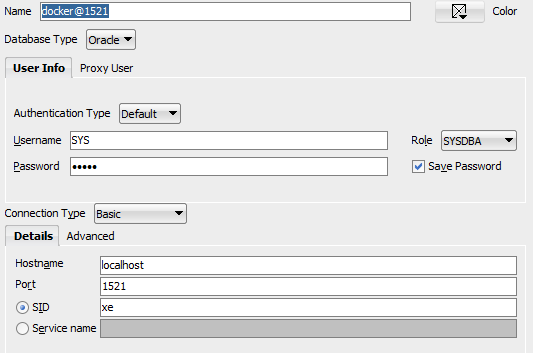

# Prerequisites:

* Make sure you have a mssql database called 'NServiceBus' running on 'localhost'

* Spin up the following [docker image](https://hub.docker.com/r/gvenzl/oracle-xe):
```powershell
docker run -d --name oracle_db -p 1521:1521 -e ORACLE_PASSWORD=admin gvenzl/oracle-xe:18
```

* Once the database is accessible (could take up to 5 minutes after starting the container), log in as 'SYS' with role 'SYSDBA' and password 'admin':



* After logging in as SYS, execute the following script
```sql
create user TESTUSER identified by "TESTUSER";
GRANT ALL PRIVILEGES TO TESTUSER;
create table TESTUSER.test (id number not null);
```

* Run app